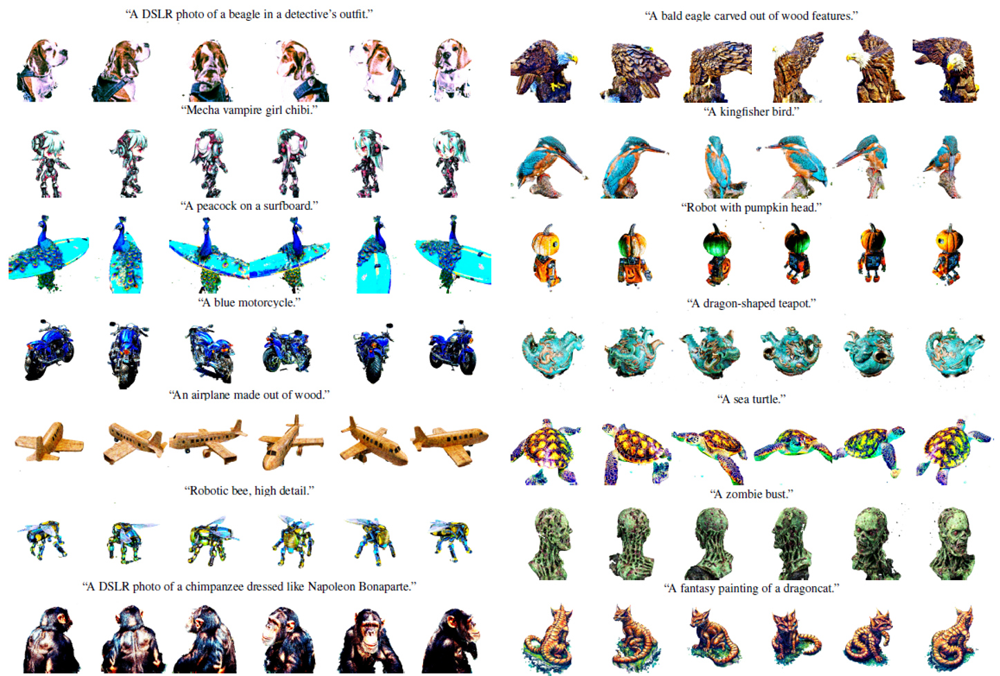

# RecDreamer

Official implementation of *[RecDreamer: Consistent Text-to-3D Generation via Uniform Score Distillation](https://arxiv.org/abs/2502.12640)*, published in ICLR 2025.


<p align="center">
 
</p>

## Installation

For installation, 
```
pip install -r requirements.txt
```

## 🚀 Getting Started

### 1. Download Pretrained Classifier Weights
Download and extract weights to project root
> 📥 Weights Source: [Google Drive](https://drive.google.com/drive/folders/1rbky25u6A_96MtKEs4Pzu_M2HvBci7Y?usp=sharing)

### 2. Execution Pipeline
RecDreamer follows a 3-stage generation workflow similar to ProlificDreamer:

```bash
# Stage 1: Initial Optimization
bash scripts/exp_stage1.sh <cuda-device-id>

# Stage 2: Geometric Refinement
bash scripts/exp_stage2.sh <cuda-device-id>

# Stage 3: Final Rendering
bash scripts/exp_stage3.sh <cuda-device-id>
```
> 🔧 Replace `<cuda-device-id>` with your GPU index (e.g., `0` for the first GPU).


## ⚙️ Configuration Management

### Instance Specification
The instances are defined in the file `classifier_configs.json`. Specify the instance for optimization in the file `scripts/exp_stage1.sh` (Line 18).


## 🛠 Development Status
**Active Development Roadmap**:
• 🛠 Additional feature implementation in progress
• ✅ Targeted patch release by April 26th (bug fixes & stability improvements)


First, download the classifier weights from the [source](https://drive.google.com/drive/folders/1rbky25u6A_96MtKEs4Pzu_M2HvBwci7Y?usp=sharing) and unzip it into the current folder.

<!-- **Limitations:** (1) Our work takes extra time for optimization. -->

## TODO List
- [x] Release RecDreamer for 3D.
- [ ] Release RecDreamer for 2D.
- [ ] Custom classifier for orientation.
- [ ] Custom classifier with Zero-123.

## Related Links
​​We sincerely extend our gratitude to the following repositories for their contributions.​
- [ProlificDreamer](https://github.com/thu-ml/prolificdreamer)
- [DreamFusion](https://dreamfusion3d.github.io/)
- [Threestudio](https://github.com/threestudio-project/threestudio)
- [GeoAware-SC](https://github.com/Junyi42/geoaware-sc)


## BibTeX
If you find our work useful for your project, please consider citing the following paper.

```
@inproceedings{zheng2025recdreamer,
 title={Recdreamer: Consistent text-to-3d generation via uniform score distillation},
 author={Zheng, Chenxi and Lin, Yihong and Liu, Bangzhen and Xu, Xuemiao and Nie, Yongwei and He, Shengfeng},
 booktitle={The Thirteenth International Conference on Learning Representations},
 year={2025}
}
```
